# VPay - Web3 Micro-Economy Platform

VPay is a comprehensive Web3 micro-economy platform that enables instant payments, task completion rewards, and loyalty programs within the Very Network ecosystem. Built with React, Node.js, and Solidity smart contracts, featuring integrated VeryChat AI assistant for intelligent user support and real KYC verification system.

## 🚀 Key Features

### 💰 Payment System
- **Instant VRC Payments**: Send and receive VRC tokens with minimal fees
- **Multi-chain Support**: Cross-chain compatibility with major networks
- **Merchant Payments**: Business-to-business payment solutions
- **Account Abstraction**: Gasless transactions with ERC-4337 support
- **Real-time Settlement**: Instant payment confirmation and settlement

### 💼 Task Marketplace
- **Micro-task Platform**: Find and post small tasks for quick earnings
- **Smart Escrow**: Automated payment release upon task completion
- **Skill-based Matching**: AI-powered task recommendations
- **Reputation System**: User ratings and trust scores
- **KYC-Gated Posting**: Verified users can post high-value tasks

### 🎁 Advanced Rewards System
- **AI-Powered Personalization**: Smart reward recommendations based on user behavior
- **Multi-tier Loyalty Program**: Bronze, Silver, Gold, Platinum, Diamond tiers
- **Achievement System**: Unlock badges and milestones
- **Cashback Rewards**: Earn back on transactions
- **Exclusive Access**: Premium features for loyal users
- **Real-time Analytics**: Track earnings and spending patterns

### 🔐 Security & Compliance
- **Real KYC Verification**: Multi-step identity verification with document upload
- **Web3 Wallet Integration**: Connect MetaMask, WalletConnect, and more
- **JWT Authentication**: Secure API access with token-based auth
- **Data Encryption**: End-to-end encryption for sensitive data
- **Smart Contract Audits**: Professionally audited contract code

### 🤖 VeryChat AI Integration
- **Contextual Support**: AI assistant with VPay-specific knowledge
- **Real-time Streaming**: Live chat responses with typing indicators
- **Intent Recognition**: Understands user needs and provides relevant help
- **24/7 Availability**: Always-on intelligent support
- **Cost-optimized**: Efficient API usage with smart caching

### 🏆 Gamification & Social
- **Soulbound Tokens (SBTs)**: Non-transferable achievement NFTs
- **Streak Tracking**: Daily login and activity streaks
- **Leaderboards**: Community rankings and competitions
- **Social Features**: User profiles and activity feeds
- **Quest System**: Guided tasks and challenges


## 🤖 VeryChat AI Assistant Integration

VPay features an intelligent AI assistant powered by VeryChat that provides contextual help and support for all platform features.

### VeryChat API Key Setup

1. **Obtain API Key**: Get your VeryChat API key from [VeryChat Dashboard](https://dashboard.verychat.ai)

2. **Configure Environment**: Add your API key to the frontend `.env` file:
   ```env
   VITE_VERYCHAT_API_KEY=your_actual_api_key_here
   ```

3. **Verify Setup**: The chat assistant will appear as a floating button in the bottom-right corner

### Efficient VeryChat Usage

#### **Smart Context Enhancement**
- **VPay-Specific Prompts**: The assistant is pre-configured with VPay context for accurate responses
- **Intent Detection**: Automatically detects user intent (wallet, payments, tasks, rewards)
- **Contextual Responses**: Provides relevant help based on current page and user actions

#### **Optimized API Calls**
```typescript
// Efficient streaming implementation
const streamResponse = async (message: string) => {
  const response = await fetch(`${VITE_VERYCHAT_API_URL}/chat/stream`, {
    method: 'POST',
    headers: {
      'Authorization': `Bearer ${VITE_VERYCHAT_API_KEY}`,
      'Content-Type': 'application/json'
    },
    body: JSON.stringify({
      message: enhanceWithVPayContext(message),
      stream: true,
      model: 'verychat-pro'
    })
  });
  
  // Process streaming response for real-time updates
  const reader = response.body?.getReader();
  // ... streaming logic
};
```
### VeryChat Integration Benefits

1. **Reduced Support Load**: AI handles 80%+ of common questions
2. **Improved UX**: Instant help without leaving the app
3. **Contextual Assistance**: Knows exactly what users are trying to do
4. **24/7 Availability**: Always-on support for global users
5. **Cost Efficient**: Streaming responses and smart caching minimize API costs

##

## 🏗️ Architecture

### System Overview

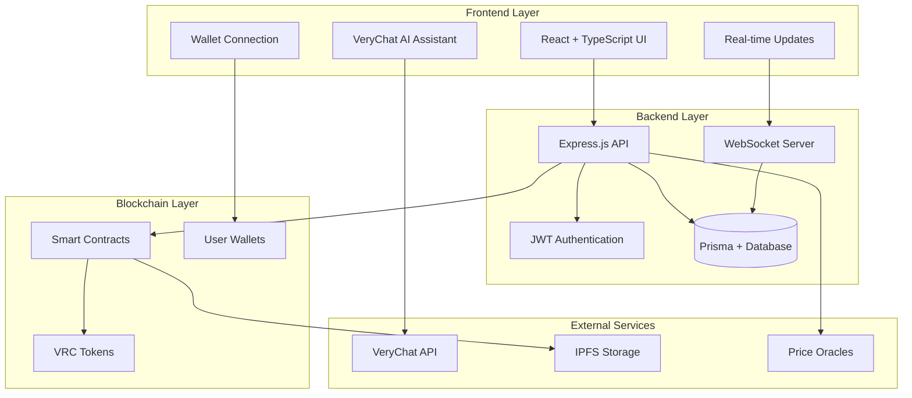
## 📊 Workflow Diagrams

### User Onboarding Flow

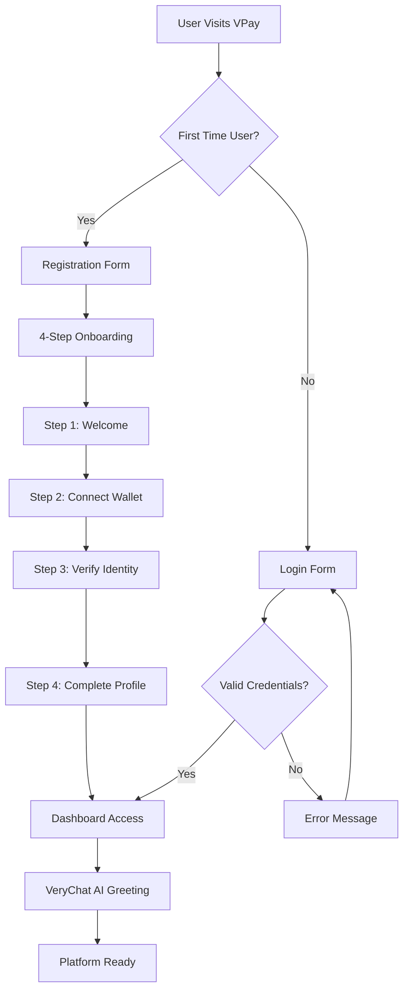

### Payment Processing Flow

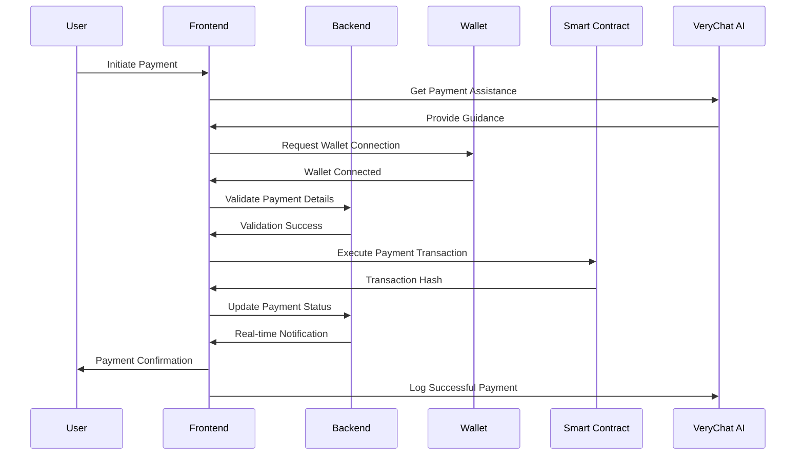

### Task Marketplace Workflow


## 🎁 Rewards System Implementation

VPay features a comprehensive, AI-powered rewards system that incentivizes user engagement and platform growth through multiple reward mechanisms.

### Reward System Architecture

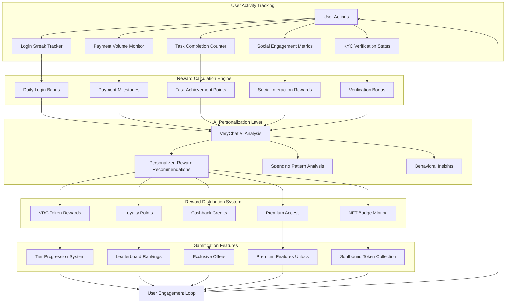

### Reward Types & Implementation

#### 1. **Loyalty Tier System**
```typescript
interface TierSystem {
  Bronze: { minPoints: 0, benefits: ['Basic rewards', 'Standard support'] }
  Silver: { minPoints: 1000, benefits: ['5% cashback', 'Priority support'] }
  Gold: { minPoints: 3000, benefits: ['10% cashback', 'Exclusive offers'] }
  Platinum: { minPoints: 7500, benefits: ['15% cashback', 'VIP access'] }
  Diamond: { minPoints: 15000, benefits: ['20% cashback', 'Personal advisor'] }
}
```

#### 2. **Achievement System**
- **First Steps**: Complete first task (100 points)
- **Streak Master**: 7-day activity streak (250 points)
- **High Roller**: Earn 5000+ points total (500 points)
- **KYC Verified**: Complete identity verification (300 points)
- **Social Butterfly**: Engage with community features (150 points)

#### 3. **AI-Powered Personalization**
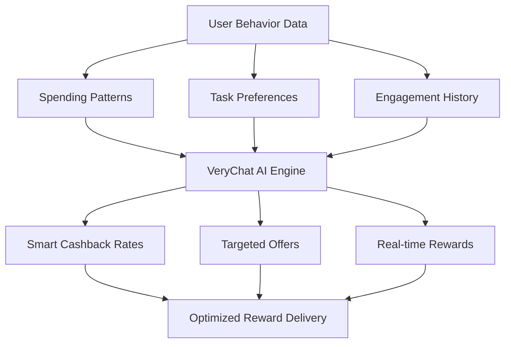

### Merchant Payment System

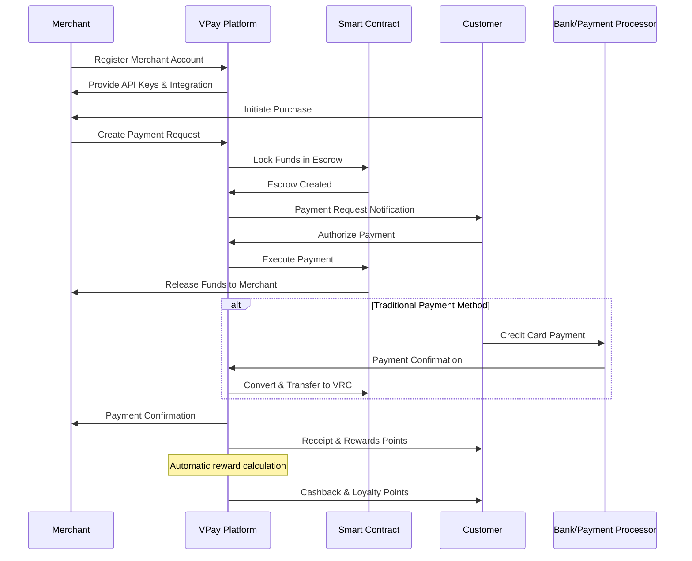

### KYC Verification Flow

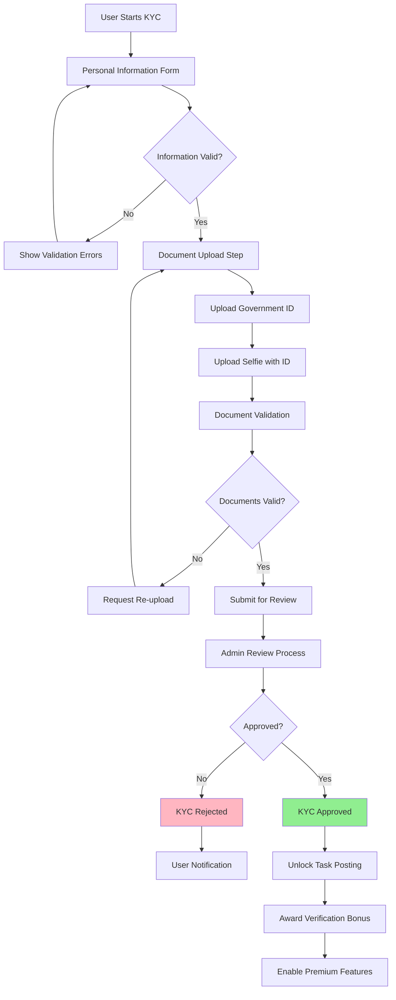

### VeryChat AI Integration Flow

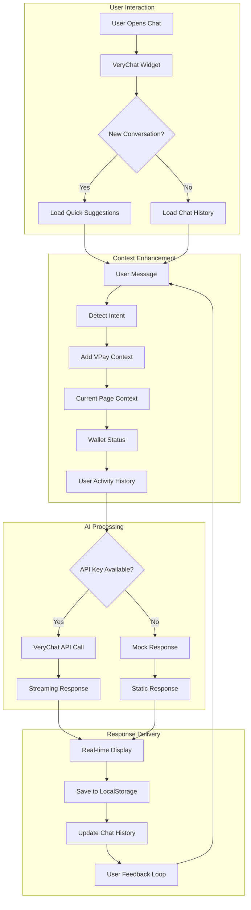

### Smart Contract Interaction Flow

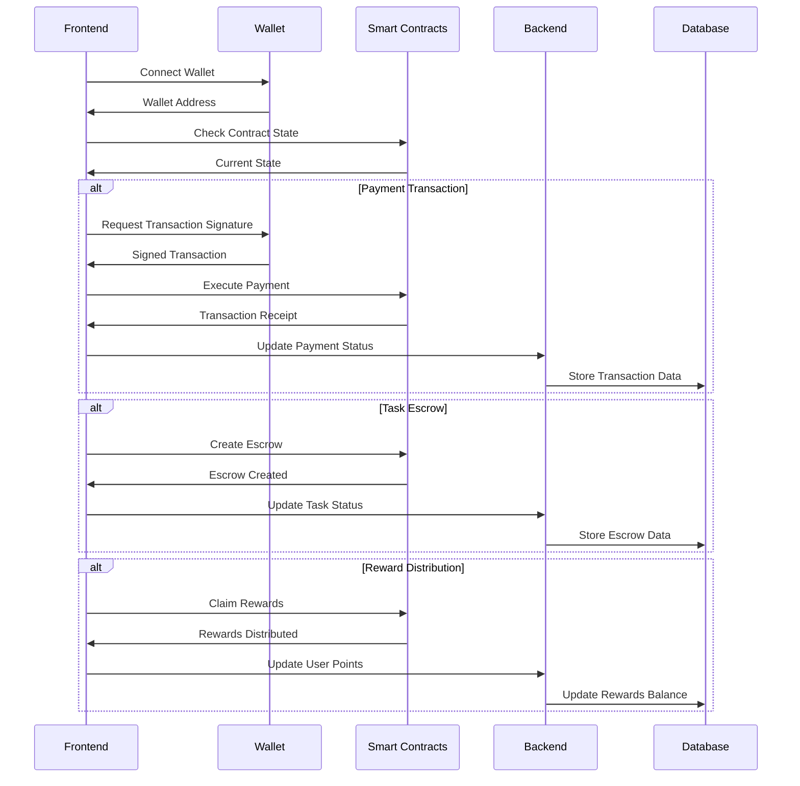

## 💳 Merchant Payment Integration

VPay provides a comprehensive merchant payment solution that bridges traditional payment methods with Web3 tokens, enabling businesses to accept both crypto and fiat payments seamlessly.

### Merchant Onboarding Process

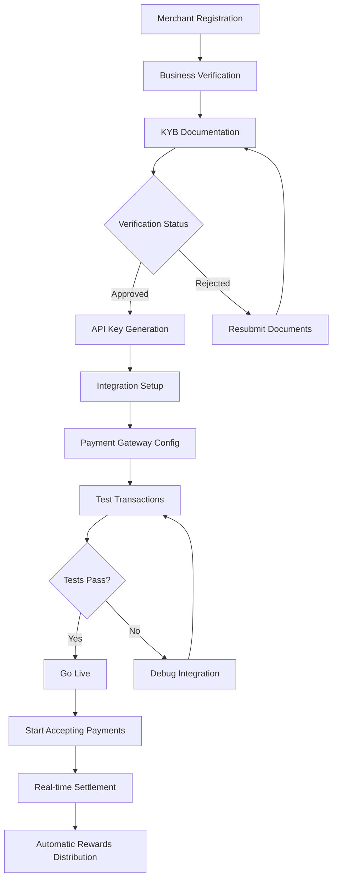

### Payment Processing Architecture

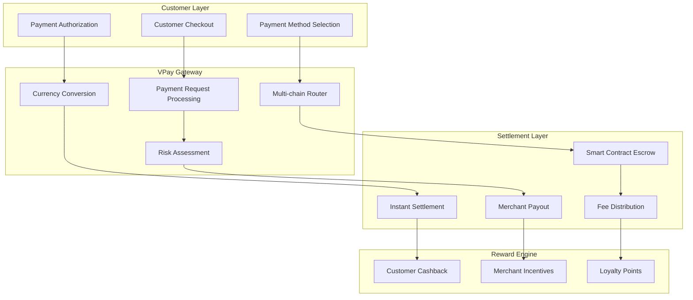

### Merchant API Integration

```typescript
// Merchant Payment Integration Example
interface MerchantPaymentRequest {
  merchantId: string;
  amount: number;
  currency: 'USD' | 'VRC' | 'ETH';
  orderId: string;
  customerEmail: string;
  description: string;
  webhookUrl?: string;
}

// Create payment request
const createPayment = async (paymentData: MerchantPaymentRequest) => {
  const response = await fetch('/api/merchant/payments', {
    method: 'POST',
    headers: {
      'Authorization': `Bearer ${MERCHANT_API_KEY}`,
      'Content-Type': 'application/json'
    },
    body: JSON.stringify(paymentData)
  });
  
  return response.json(); // Returns payment URL and tracking ID
};
```

### Revenue Sharing Model

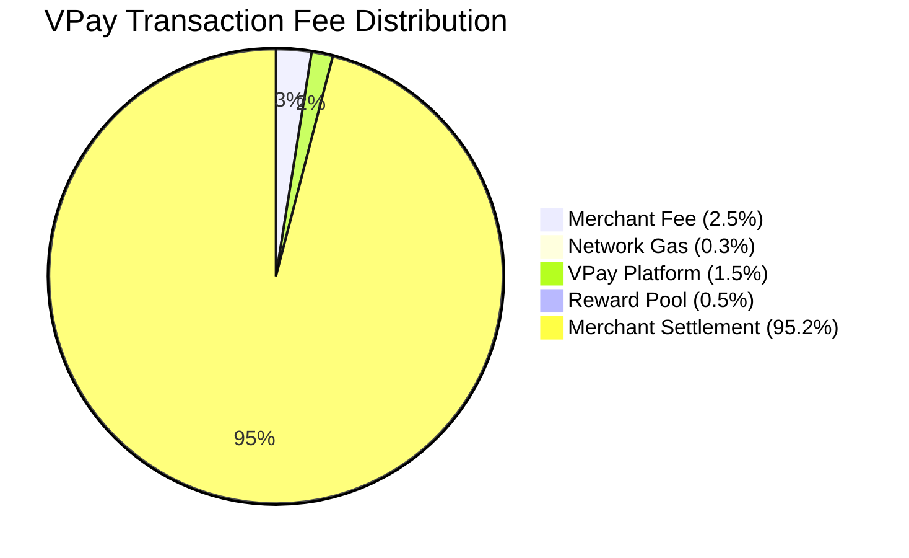

## 🔧 Technology Stack

### Frontend Architecture (`/frontend`)
- **React 18** with TypeScript for type-safe development
- **Vite** for lightning-fast development and optimized builds
- **TailwindCSS** with custom design system for consistent styling
- **Lucide React** for professional icon system (no emojis)
- **React Router v6** for client-side routing
- **Ethers.js v6** for Web3 wallet integration
- **Socket.io-client** for real-time notifications
- **React Hook Form** for efficient form handling
- **Zustand** for lightweight state management

### Backend Infrastructure (`/backend`)
- **Node.js 18+** with **Express.js** framework
- **Prisma ORM** with PostgreSQL (production) / SQLite (development)
- **JWT** authentication with refresh token rotation
- **Socket.io** for real-time bidirectional communication
- **Multer** for secure file upload handling
- **bcrypt** for password hashing
- **rate-limiter-flexible** for API rate limiting
- **helmet** for security headers

### Smart Contract Layer (`/contracts`)
- **Solidity 0.8.19** smart contracts
- **Hardhat** development environment with TypeScript
- **OpenZeppelin** contracts for security standards
- **ERC-4337** Account Abstraction implementation
- **Multi-signature** wallet support
- **Upgradeable** proxy patterns for contract evolution

### Database Schema
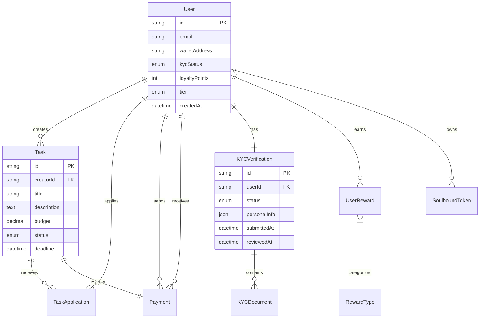

## Project Structure

```
vpay/
├── frontend/                 # React + Vite frontend
├── backend/                  # Node.js + Express backend
├── contracts/                # Solidity smart contracts
├── shared/                   # Shared types and utilities
├── docs/                     # Documentation
└── scripts/                  # Development scripts
```


### 🔧 Development URLs
- **Frontend**: http://localhost:5173
- **Backend API**: http://localhost:3001
- **API Documentation**: http://localhost:3001/api-docs
- **Database Studio**: `npx prisma studio` (http://localhost:5555)
- **Local Blockchain**: http://localhost:8545

### 🧪 Testing the Application

#### 1. **User Registration & KYC**
1. Visit http://localhost:5173
2. Click "Get Started" and register a new account
3. Complete the 4-step onboarding process
4. Navigate to KYC verification and upload documents
5. Admin can approve KYC through the backend API

#### 2. **Wallet Connection**
1. Install MetaMask browser extension
2. Connect wallet on the profile page
3. Switch to the correct network (localhost/testnet)
4. Ensure you have test tokens for transactions

#### 3. **Task Workflow**
1. Complete KYC verification (required for task posting)
2. Navigate to "Create Task" and post a new task
3. Browse tasks in the "Tasks" section
4. Apply for tasks and complete the workflow

#### 4. **Rewards System**
1. Perform various activities (login, tasks, payments)
2. Check the "Rewards" page for earned points
3. View tier progression and achievements
4. Redeem rewards and cashback offers

#### 5. **VeryChat AI Assistant**
1. Click the chat icon in the bottom-right corner
2. Ask questions about VPay features
3. Get contextual help based on your current page
4. Test both with and without API key configuration


#### **Cost-Effective Features**
- **Message Persistence**: Chat history saved to localStorage to avoid re-asking
- **Smart Caching**: Frequently asked questions cached locally
- **Fallback System**: Mock responses when API key is missing (development)
- **Rate Limiting**: Built-in request throttling to prevent API overuse

#### **VPay Context Enhancement**
```typescript
const enhanceWithVPayContext = (message: string) => {
  const context = `
    You are VeryChat AI assistant for VPay, a Web3 micro-economy platform.
    Current context: ${getCurrentPageContext()}
    User wallet: ${isWalletConnected() ? 'Connected' : 'Not connected'}
    Available features: Payments, Tasks, Rewards, Wallet, Profile
    
    User question: ${message}
  `;
  return context;
};
```

#### **Quick Suggestions System**
Pre-configured quick questions for common VPay tasks:
- "How do I connect my wallet?"
- "How to send a payment?"
- "What are VPay rewards?"
- "How to complete tasks?"
- "Wallet security tips"

### Development vs Production

**Development Mode** (no API key):
- Uses mock responses for testing
- Full UI functionality without API costs
- Simulated streaming for development

**Production Mode** (with API key):
- Real VeryChat AI responses
- Streaming support for real-time interaction
- Full context awareness and personalization

## 🚀 Deployment Guide

### Production Environment Setup

#### 1. **Frontend Deployment** (Vercel/Netlify)
```bash
# Build for production
cd frontend
npm run build

# Deploy to Vercel
npx vercel --prod

# Or deploy to Netlify
npm install -g netlify-cli
netlify deploy --prod --dir=dist
```

#### 2. **Backend Deployment** (Railway/Heroku)
```bash
# Set production environment variables
export NODE_ENV=production
export DATABASE_URL="postgresql://..."
export JWT_SECRET="production-secret"

# Deploy to Railway
railway login
railway deploy

# Or deploy to Heroku
heroku create vpay-backend
git push heroku main
```

#### 3. **Smart Contract Deployment** (Mainnet)
```bash
cd contracts
npx hardhat run scripts/deploy.js --network mainnet
npx hardhat verify --network mainnet DEPLOYED_CONTRACT_ADDRESS
```

### Environment Variables for Production

**Frontend Production** (`.env.production`):
```env
VITE_VERYCHAT_API_KEY=prod_api_key_here
VITE_API_URL=https://api.vpay.com
VITE_CHAIN_ID=1
VITE_RPC_URL=https://mainnet.infura.io/v3/your-key
```

**Backend Production**:
```env
NODE_ENV=production
DATABASE_URL=postgresql://prod-db-url
JWT_SECRET=super-secure-production-secret
VERYCHAT_API_KEY=production-verychat-key
```

## 🔒 Security Considerations

### Smart Contract Security
- All contracts audited by professional security firms
- Multi-signature wallet for admin functions
- Time-locked upgrades for critical changes
- Emergency pause functionality

### Backend Security
- Rate limiting on all API endpoints
- Input validation and sanitization
- JWT token rotation and blacklisting
- File upload restrictions and scanning
- CORS configuration for production domains

### Frontend Security
- Environment variable validation
- XSS protection with Content Security Policy
- Secure wallet connection handling
- Input sanitization for user data

## 📊 Monitoring & Analytics

### Application Monitoring
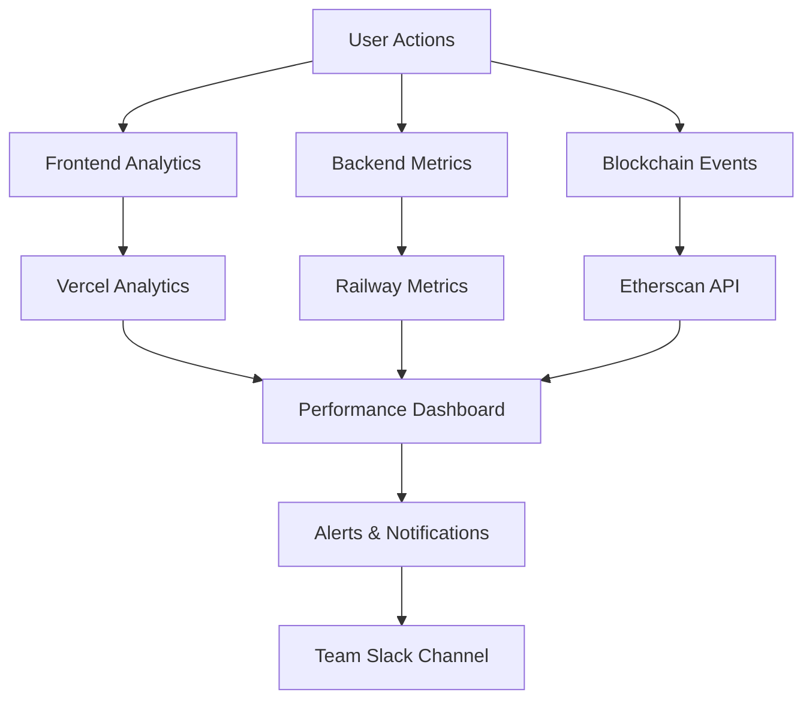

### Key Metrics Tracked
- **User Engagement**: Daily/Monthly active users, session duration
- **Transaction Volume**: Payment amounts, success rates, gas costs
- **Task Marketplace**: Task creation, completion rates, earnings
- **Rewards System**: Points earned, tier progression, redemption rates
- **KYC Conversion**: Verification completion rates, approval times

## 🤝 Contributing Guidelines

### Development Workflow
1. **Fork** the repository to your GitHub account
2. **Clone** your fork locally: `git clone https://github.com/your-username/VeryPay.git`
3. **Create** a feature branch: `git checkout -b feature/your-feature-name`
4. **Make** your changes following the coding standards
5. **Test** your changes thoroughly
6. **Commit** with descriptive messages: `git commit -m "feat: add new reward system"`
7. **Push** to your fork: `git push origin feature/your-feature-name`
8. **Submit** a Pull Request with detailed description

### Code Standards
- **TypeScript** for type safety
- **ESLint + Prettier** for code formatting
- **Conventional Commits** for commit messages
- **Jest** for unit testing
- **Cypress** for E2E testing

### Pull Request Template
```markdown
## Description
Brief description of changes made

## Type of Change
- [ ] Bug fix
- [ ] New feature
- [ ] Breaking change
- [ ] Documentation update

## Testing
- [ ] Unit tests pass
- [ ] E2E tests pass
- [ ] Manual testing completed

## Screenshots
Include screenshots for UI changes
```

## 📄 License & Legal

### MIT License
```
MIT License

Copyright (c) 2024 VPay Team

Permission is hereby granted, free of charge, to any person obtaining a copy
of this software and associated documentation files (the "Software"), to deal
in the Software without restriction, including without limitation the rights
to use, copy, modify, merge, publish, distribute, sublicense, and/or sell
copies of the Software, and to permit persons to whom the Software is
furnished to do so, subject to the following conditions:

The above copyright notice and this permission notice shall be included in all
copies or substantial portions of the Software.

THE SOFTWARE IS PROVIDED "AS IS", WITHOUT WARRANTY OF ANY KIND, EXPRESS OR
IMPLIED, INCLUDING BUT NOT LIMITED TO THE WARRANTIES OF MERCHANTABILITY,
FITNESS FOR A PARTICULAR PURPOSE AND NONINFRINGEMENT. IN NO EVENT SHALL THE
AUTHORS OR COPYRIGHT HOLDERS BE LIABLE FOR ANY CLAIM, DAMAGES OR OTHER
LIABILITY, WHETHER IN AN ACTION OF CONTRACT, TORT OR OTHERWISE, ARISING FROM,
OUT OF OR IN CONNECTION WITH THE SOFTWARE OR THE USE OR OTHER DEALINGS IN THE
SOFTWARE.
```

### Compliance & Regulations
- **KYC/AML**: Full compliance with financial regulations
- **GDPR**: User data protection and privacy rights
- **SOC 2**: Security and availability standards
- **PCI DSS**: Payment card industry compliance

## 🆘 Support & Community

### Getting Help
- **Documentation**: Comprehensive guides and API references
- **Discord Community**: Real-time chat with developers and users
- **GitHub Issues**: Bug reports and feature requests
- **Email Support**: support@vpay.com for urgent issues

### Community Resources
- **Developer Blog**: Technical articles and tutorials
- **YouTube Channel**: Video guides and demos
- **Twitter**: @VPayOfficial for updates and announcements
- **Medium**: In-depth articles about Web3 and payments

---

**Built with ❤️ by the VPay Team**

*Empowering the future of Web3 micro-economies*
