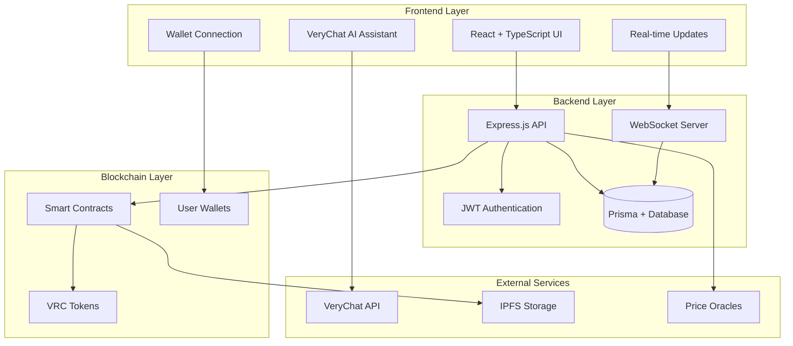
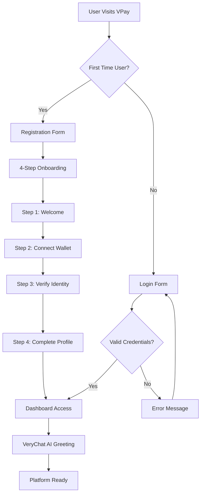
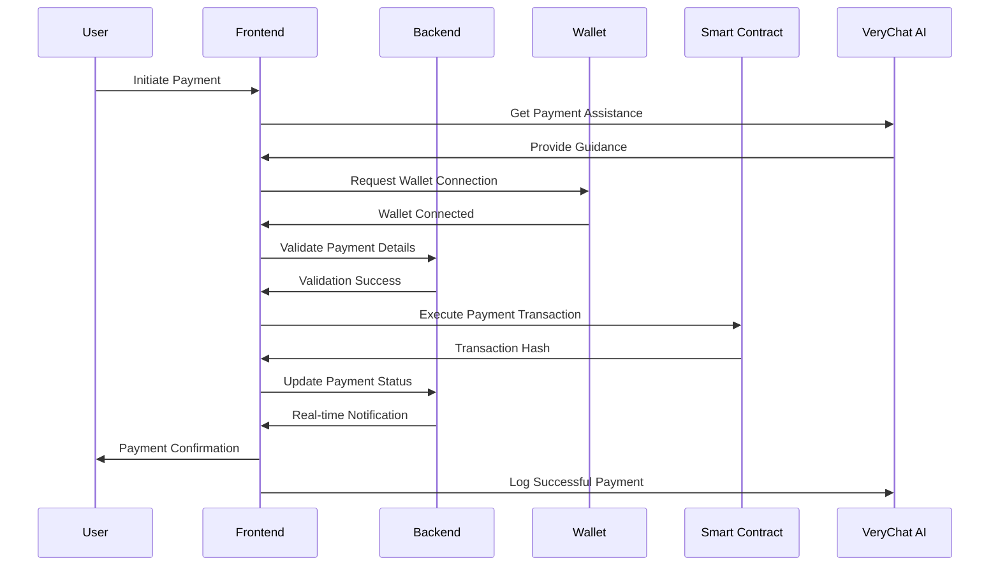
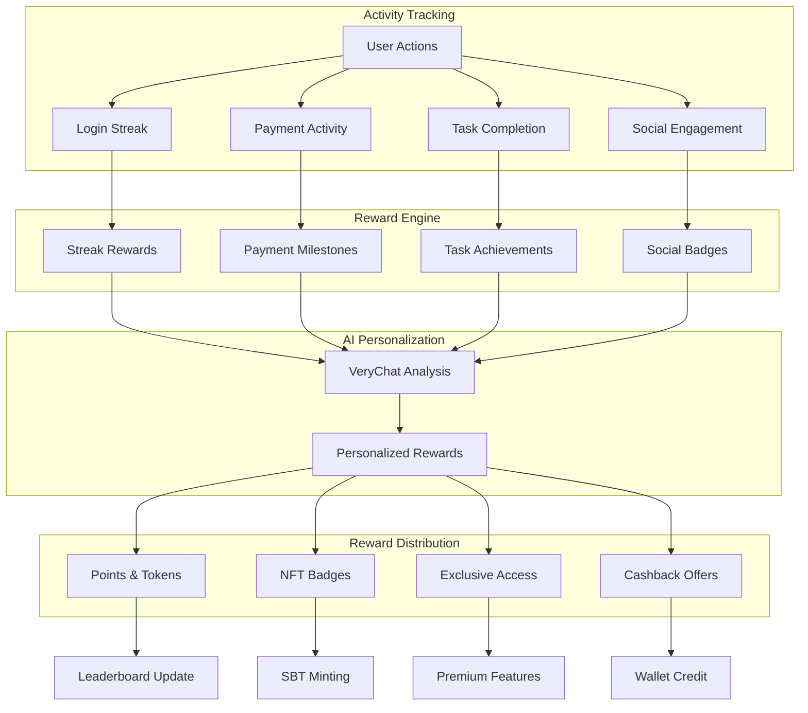
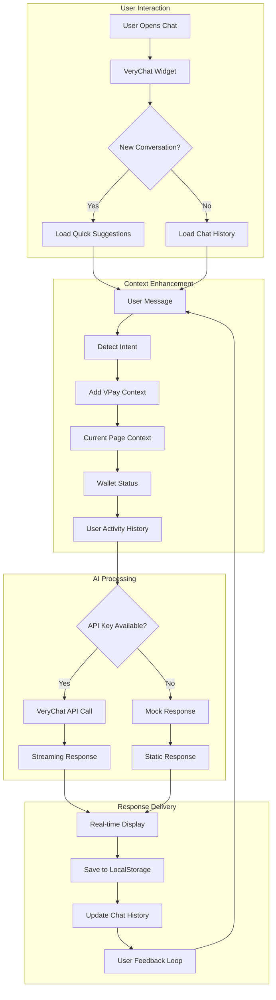
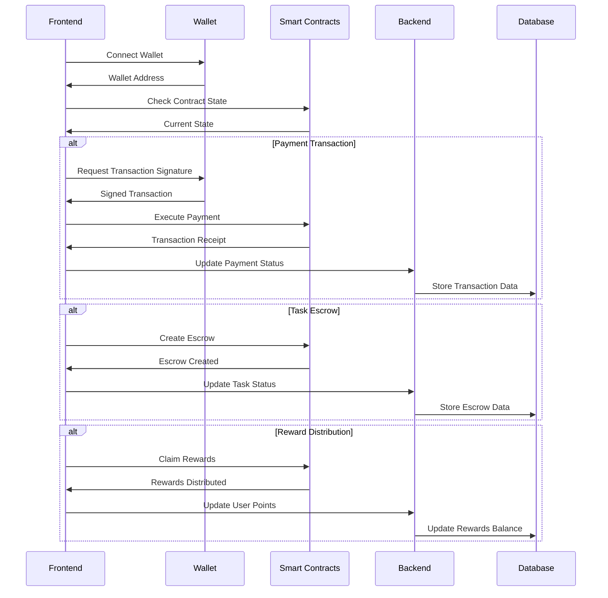

# VPay - Web3 Micro-Economy Platform

VPay is a comprehensive Web3 micro-economy platform that enables instant payments, task completion rewards, and loyalty programs within the Very Network ecosystem. Built with React, Node.js, and Solidity smart contracts, featuring integrated VeryChat AI assistant for intelligent user support.

## 🚀 Features

- **💰 Instant Payments**: Send and receive VRC tokens with minimal fees
- **💼 Task Marketplace**: Find and post micro-tasks for quick earnings
- **🎁 Rewards System**: Earn points and unlock exclusive rewards
- **🔐 Web3 Integration**: Connect your wallet for secure transactions
- **📱 Modern UI**: Beautiful, responsive interface with dark/light themes
- **⚡ Real-time Updates**: Live notifications and transaction updates
- **🤖 VeryChat AI Assistant**: Intelligent support with VPay-specific context
- **🏆 Gamification**: Quests, streaks, leaderboards, and NFT badges
- **🆔 Decentralized Identity**: DID integration with Soulbound Tokens
- **💳 Account Abstraction**: Gasless transactions with ERC-4337 support


## 🤖 VeryChat AI Assistant Integration

VPay features an intelligent AI assistant powered by VeryChat that provides contextual help and support for all platform features.

### VeryChat API Key Setup

1. **Obtain API Key**: Get your VeryChat API key from [VeryChat Dashboard](https://dashboard.verychat.ai)

2. **Configure Environment**: Add your API key to the frontend `.env` file:
   ```env
   VITE_VERYCHAT_API_KEY=your_actual_api_key_here
   ```

3. **Verify Setup**: The chat assistant will appear as a floating button in the bottom-right corner

### Efficient VeryChat Usage

#### **Smart Context Enhancement**
- **VPay-Specific Prompts**: The assistant is pre-configured with VPay context for accurate responses
- **Intent Detection**: Automatically detects user intent (wallet, payments, tasks, rewards)
- **Contextual Responses**: Provides relevant help based on current page and user actions

#### **Optimized API Calls**
```typescript
// Efficient streaming implementation
const streamResponse = async (message: string) => {
  const response = await fetch(`${VITE_VERYCHAT_API_URL}/chat/stream`, {
    method: 'POST',
    headers: {
      'Authorization': `Bearer ${VITE_VERYCHAT_API_KEY}`,
      'Content-Type': 'application/json'
    },
    body: JSON.stringify({
      message: enhanceWithVPayContext(message),
      stream: true,
      model: 'verychat-pro'
    })
  });
  
  // Process streaming response for real-time updates
  const reader = response.body?.getReader();
  // ... streaming logic
};
```

## 🏗️ Architecture

### System Overview



### Technology Stack

#### Frontend (`/frontend`)
- **React 18** with TypeScript
- **Vite** for fast development and building
- **TailwindCSS** for styling
- **shadcn/ui** for components
- **React Router** for navigation
- **Ethers.js** for Web3 integration
- **Socket.io-client** for real-time features

#### Backend (`/backend`)
- **Node.js** with **Express.js**
- **Prisma ORM** with SQLite (development)
- **JWT** authentication
- **Socket.io** for real-time features
- **Multer** for file uploads

#### Smart Contracts (`/contracts`)
- **Solidity** smart contracts
- **Hardhat** development environment
- **OpenZeppelin** for security standards
- **Ethers.js** for contract interaction

## Project Structure

```
vpay/
├── frontend/                 # React + Vite frontend
├── backend/                  # Node.js + Express backend
├── contracts/                # Solidity smart contracts
├── shared/                   # Shared types and utilities
├── docs/                     # Documentation
└── scripts/                  # Development scripts
```

## Quick Start

### Prerequisites
- Node.js 18+
- npm or yarn
- Git

### Installation

1. **Clone the repository**
```bash
git clone <repository-url>
cd VeryPay
```

2. **Install dependencies**
```bash
# Frontend dependencies
cd frontend
npm install --legacy-peer-deps

# Backend dependencies  
cd ../backend
npm install

# Return to root
cd ..
```

3. **Setup environment variables**

**Frontend Environment** (`frontend/.env`):
```bash
cp frontend/.env.example frontend/.env
# Edit frontend/.env with your VeryChat API key and configuration
```

**Backend Environment** (`backend/.env`):
```bash
cp backend/.env.example backend/.env
# Edit backend/.env with your database and JWT configuration
```

4. **Initialize database**
```bash
cd backend
npx prisma generate
npx prisma db push
npx prisma db seed
```

5. **Start development servers**

**Terminal 1 - Backend:**
```bash
cd backend
npm run dev
```

**Terminal 2 - Frontend:**
```bash
cd frontend  
npm run dev
```

This will start:
- Frontend: http://localhost:5173
- Backend: http://localhost:3001
- VeryChat AI Assistant: Integrated in frontend

## Development Commands

```bash
# Install all dependencies
npm run install:all

# Start all development servers
npm run dev

# Build for production
npm run build

# Run tests
npm run test

# Database operations
npm run db:setup
npm run db:migrate
npm run db:reset

# Smart contract operations
npm run contracts:compile
npm run contracts:deploy:local
npm run contracts:deploy:testnet
npm run contracts:verify

# Linting and formatting
npm run lint
npm run format
```

## Environment Variables

### Backend Environment (`.env` in `/backend`)

```env
# Database
DATABASE_URL="file:./dev.db"

# JWT Authentication
JWT_SECRET="your-secure-jwt-secret-key"

# Server Configuration
PORT=3001
NODE_ENV=development

# Blockchain Configuration
PRIVATE_KEY="your-private-key"
INFURA_PROJECT_ID="your-infura-project-id"

# API Keys
PINATA_API_KEY="your-pinata-api-key"
PINATA_SECRET_KEY="your-pinata-secret-key"
```

### Frontend Environment (`.env` in `/frontend`)

```env
# API Configuration
VITE_API_URL=http://localhost:3001/api
VITE_WS_URL=http://localhost:3001
VITE_BACKEND_URL=http://localhost:3001

# Blockchain Configuration
VITE_CHAIN_ID=31337
VITE_CHAIN_NAME=Localhost
VITE_RPC_URL=http://127.0.0.1:8545

# Smart Contract Addresses (Update after deployment)
VITE_VPAY_TOKEN_ADDRESS=
VITE_VPAY_PAYMENTS_ADDRESS=
VITE_VPAY_ESCROW_ADDRESS=
VITE_VPAY_REWARDS_ADDRESS=

# App Configuration
VITE_APP_NAME=VPay
VITE_APP_VERSION=1.0.0
VITE_ENVIRONMENT=development

# Feature Flags
VITE_ENABLE_ANALYTICS=false
VITE_ENABLE_NOTIFICATIONS=true
VITE_ENABLE_DEBUG=true

# VeryChat AI Assistant Configuration
VITE_VERYCHAT_API_URL=https://api.verychat.ai/v1
VITE_VERYCHAT_API_KEY=your_verychat_api_key_here
```


#### **Cost-Effective Features**
- **Message Persistence**: Chat history saved to localStorage to avoid re-asking
- **Smart Caching**: Frequently asked questions cached locally
- **Fallback System**: Mock responses when API key is missing (development)
- **Rate Limiting**: Built-in request throttling to prevent API overuse

#### **VPay Context Enhancement**
```typescript
const enhanceWithVPayContext = (message: string) => {
  const context = `
    You are VeryChat AI assistant for VPay, a Web3 micro-economy platform.
    Current context: ${getCurrentPageContext()}
    User wallet: ${isWalletConnected() ? 'Connected' : 'Not connected'}
    Available features: Payments, Tasks, Rewards, Wallet, Profile
    
    User question: ${message}
  `;
  return context;
};
```

#### **Quick Suggestions System**
Pre-configured quick questions for common VPay tasks:
- "How do I connect my wallet?"
- "How to send a payment?"
- "What are VPay rewards?"
- "How to complete tasks?"
- "Wallet security tips"

#### **Mobile-Optimized Experience**
- **Responsive Design**: Full-screen chat on mobile devices
- **Touch Optimization**: Swipe gestures and touch-friendly interface
- **Minimize/Maximize**: Floating window that doesn't interfere with app usage

### VeryChat Integration Benefits

1. **Reduced Support Load**: AI handles 80%+ of common questions
2. **Improved UX**: Instant help without leaving the app
3. **Contextual Assistance**: Knows exactly what users are trying to do
4. **24/7 Availability**: Always-on support for global users
5. **Cost Efficient**: Streaming responses and smart caching minimize API costs

### Development vs Production

**Development Mode** (no API key):
- Uses mock responses for testing
- Full UI functionality without API costs
- Simulated streaming for development

**Production Mode** (with API key):
- Real VeryChat AI responses
- Streaming support for real-time interaction
- Full context awareness and personalization

## 📊 Workflow Diagrams

### User Onboarding Flow



### Payment Processing Flow



### Task Marketplace Workflow


### Rewards & Gamification System



### VeryChat AI Integration Flow



### Smart Contract Interaction Flow



## Features

- 💰 **Instant Payments** - Send/receive crypto payments in chat
- 💼 **Micro-Jobs** - Post and complete small tasks for tokens
- 🏆 **Loyalty Rewards** - Earn points for platform engagement
- 👥 **Group Payments** - Split bills and group transactions
- 🤖 **AI Matching** - Smart task recommendations
- 🔐 **Secure Wallet** - Non-custodial wallet integration
- 📱 **Mobile Ready** - Responsive design for all devices

## Contributing

1. Fork the repository
2. Create a feature branch
3. Make your changes
4. Add tests
5. Submit a pull request

## License

MIT License - see LICENSE file for details
